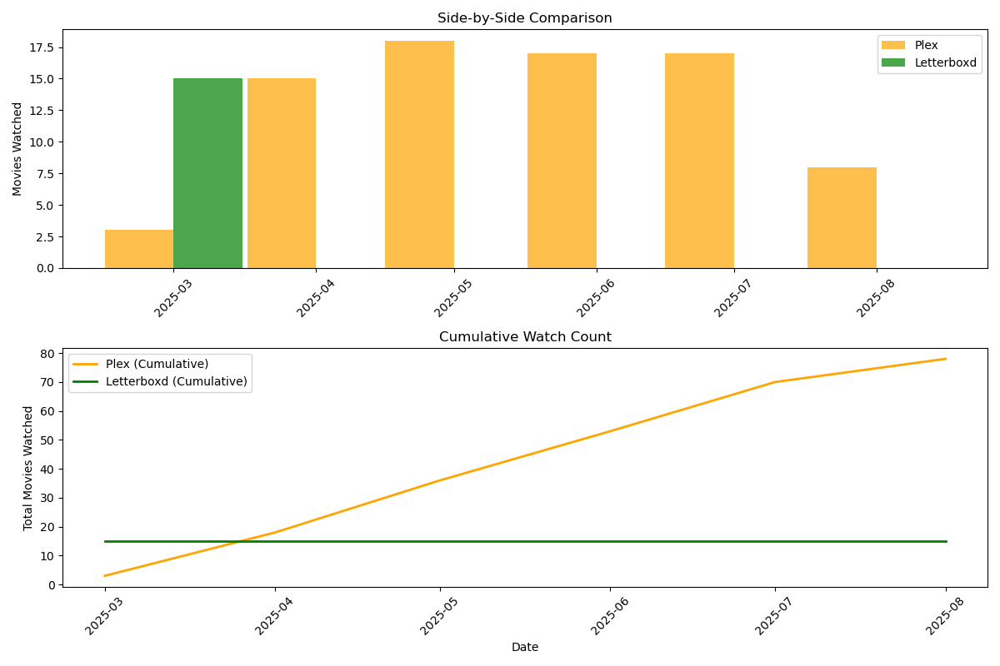

## Plex to Letterboxd Exporter

Export your Plex watch history to a Letterboxd-compatible CSV format with TMDB ID matching.

### Setup

**Install**
``` bash
git clone https://github.com/brege/plex-letterboxd.git
cd plex-letterboxd
pip install plexapi pyyaml
```

**Configure Plex Access**

**`config.yaml`**

There are two ways to configure the script to access the Plex server: 

1. Visit: https://support.plex.tv/articles/204059436-finding-an-authentication-token-x-plex-token/

   ``` yaml
   # Comment out kometa section above, then use:
   plex:
     url: http://your-plex-server:32400
     token: YOUR_PLEX_TOKEN_HERE
     timeout: 60
   ```

2. **OR** Use existing Kometa config (since you would have already configured Kometa with Plex)
   ``` yaml
   kometa:
     config_path: ./path/to/kometa/config.yml
   ```

3. Export **Plex** history to CSV

   ``` bash
   # Export specific user, if not compared
   python3 exporter.py --user USERNAME --output plex-export.csv

   # Export all users  
   python3 exporter.py

   # Export from specific date
   python3 exporter.py --user USERNAME --from-date 2024-01-01

   # Compare watched vs unwatched (no export)
   python3 exporter.py --user USERNAME --compare
   ```

4. Import to Letterboxd: https://letterboxd.com/import/

### Output Format

The CSV includes these Letterboxd-compatible columns:

| field         | description                        |
|:------------- |:---------------------------------- |
| `tmdbID`      | TMDB ID for precise matching       |
| `Title`       | Movie title                        |
| `Year`        | Release year                       |
| `Directors`   | Director names                     |
| `WatchedDate` | When you watched it (YYYY-MM-DD)   |
| `Rating`      | Optional. Your rating (0.5–5.0)    |
| `Tags`        | Movie genres                       |
| `Rewatch`     | Whether it's a rewatch             |


**Configuration**: see [`config.example.yaml`](config.example.yaml)

**Command Line**
``` bash
python3 exporter.py [options]

Options:
  --config FILE      Config file (default: letterboxd_export_config.yml)
  --output FILE      Output CSV filename
  --user USERNAME    Filter by specific Plex user
  --from-date DATE   Export from date (YYYY-MM-DD)
  --compare          Show watched vs unwatched comparison
```

### Comparison Tool

Compare your Plex export with existing Letterboxd data.
``` bash
python3 compare.py \
    --plex plex-watched-user-20250830.csv \
    --letterboxd letterboxd-export.csv \
    --from-date 2025-02-15 \
    --to-date 2025-08-10 \
    --output overlap.png
```


*Comparison of Plex vs. Letterboxd Watched Movies*

This is handy if you don't religiously record your movies on Letterboxd. It allows you to slice the data.

The script returns the command you can run, based on the ranges you provide in
`compare.py --from-date,--to-date`,
``` text
=== TIME ANALYSIS ===
Total date span: 149 days (0.4 years)
No overlapping time period

To export Plex data for this date range:
python3 exporter.py \
    --from-date 2025-02-15 \
    --to-date 2025-08-10 \
    --user YOUR_USERNAME \
    # OR --cached
```
See:
``` bash
python3 compare.py --help
```

---

### Ratings

- Enable ratings by setting `letterboxd.include_rating: true` in `config.yaml`.
- By default, Plex user ratings (1–10) are converted to Letterboxd’s 0.5–5.0 scale and rounded to the nearest half-star.
- You can disable conversion (export raw Plex values) by setting `letterboxd.convert_plex_rating_to_letterboxd: false`.
- Unrated or 0 values are exported as blank.

Example:
```yaml
letterboxd:
  include_rating: true
  convert_plex_rating_to_letterboxd: true  # default
```

Notes:
- Letterboxd import accepts half-star increments between 0.5 and 5.0.
- Plex doesn’t store per-user “reviews” similarly; the `Review` column remains blank unless you customize it.

---

**notes.**
- **degenerate titles**
  - Letterboxd's importer is quite intelligent. Since this script exports TMDB IDs from Plex, it should be able to match most movies by TMDB ID. It will very likely not match all of them, so tagging with "plex" or some unique string can help you filter the imports on Letterboxd, especially if you watched timestamps on Plex and diary entries on Letterboxd are temporally mixed.
- **read-only to Plex API**
  - never modifies the data on Plex server

---

[MIT License](LICENSE)
